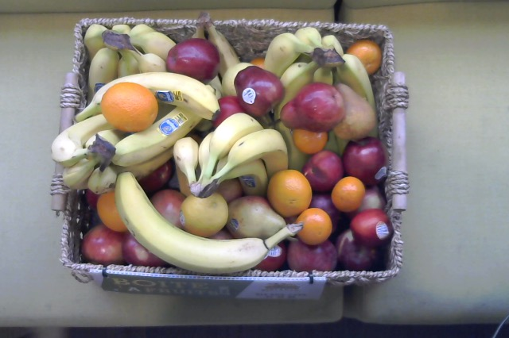
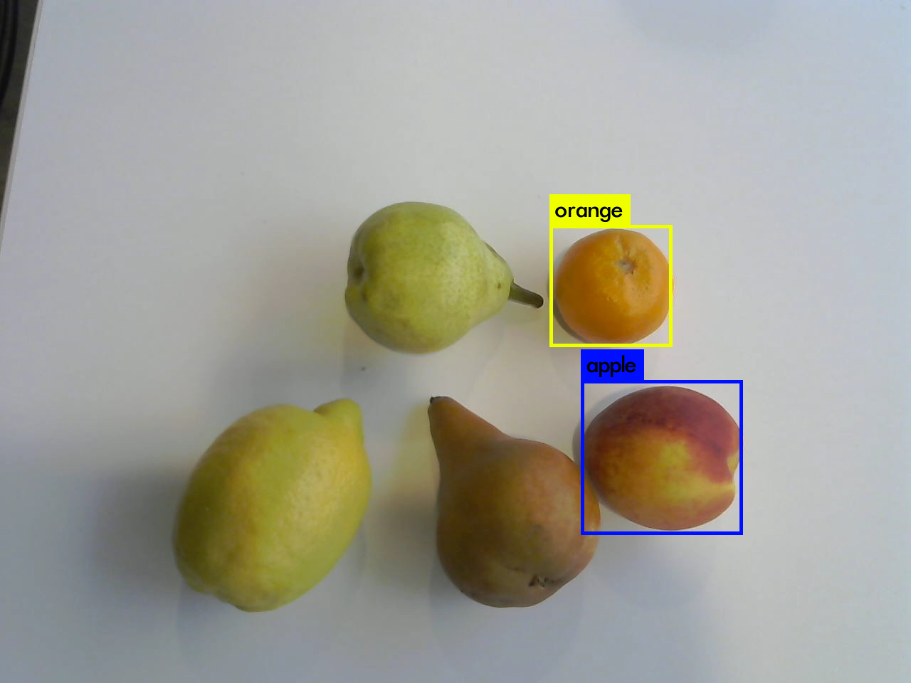
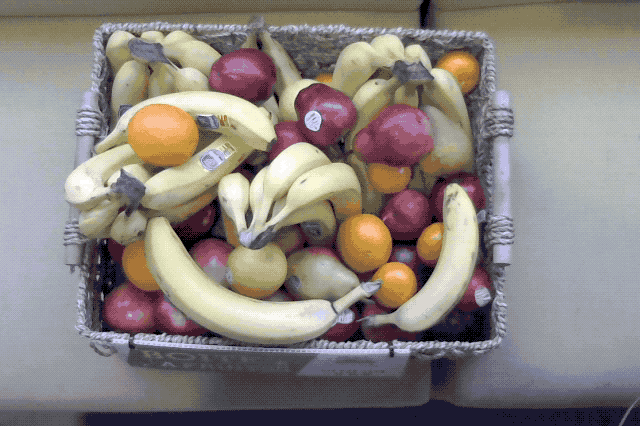

# 🍌🍌🍌🍌🍌🍌🍌🍌

*Fruit detection using YOLO 9000*

## Summary

During a two-days hackathon held internally at JDA Labs, we wanted to experiment with [YOLO 9000](https://github.com/philipperemy/yolo-9000).
We decided to point a camera at the fruit basket and see what kind of results we could get. The ultimate goal would be to be able get an quantity estimate for each type of fruits present or to the very least provide a list of the detected fruits. 

The problem we tackled is quite complex by itself as fruits are placed chaotically in the basket.

## Contributors
- Celine Bouillon
- Chloé Gérin-Lajoie
- Éric Prescott Gagnon
- Benoit Rochon

## Findings

### Not really accurate results

The results were pretty much laughable. It detected a small portion of the fruits but also gave a lot of false positives by misidentifying some fruits. Apple instead of peach. Orange instead of clementines. I can't really blame it since I can sometimes not make the difference myself.

In one out of the basket test we made two types of pear and the lemon were not identified at all.

It's something we've been expecting from such a general purpose algorithm. One follow up task  would be to train it with our own dataset. 

### Change Isolation did not not work
We attempted to take a before and after of a fruit being removed from the basket to isolate changes in the images before passing through the model.

    [(‘n04275548’, ‘spider_web’, 0.52337879),
    (‘n01773549’, ‘barn_spider’, 0.15204979),
    (‘n01773157’, ‘black_and_gold_garden_spider’, 0.0694848),
    (‘n01773797’, ‘garden_spider’, 0.066749565),
    (‘n03729826’, ‘matchstick’, 0.044424873),
    (‘n01930112’, ‘nematode’, 0.016517423),
    (‘n02999410’, ‘chain’, 0.013418476),
    (‘n03532672’, ‘hook’, 0.0068830671),
    (‘n01910747’, ‘jellyfish’, 0.0063939695),
    (‘n04286575’, ‘spotlight’, 0.0046173348),
    (‘n01770393’, ‘scorpion’, 0.0044700429),
    (‘n01774384’, ‘black_widow’, 0.0039519817)]

Eww, that does not look right.

If we were able to train the model on a set of change isolation images, we would probably get better results.

### Not good at estimating quantities
We honestly did not expected it to be able to provide a reliant estimate of the quantity of fruits of each type prior to the experiment and it got confirmed. It is another type of task that is really difficult to do even for a human because of the lack of information a 2D picture can provide. 

### Good for bananas
As it turns out, Yolo 9000 was pretty good at detecting bananas. While it was not able to detect all of them, it was able to identify a few or at least one when some were present.

This is great, bananas are popular at the office and they are the first ones to go.
For some reason, the bananas are usually placed on top of the fruits at delivery. This is awesome as it improves the chance of them being detected. 

## Proof of concept structure
### Fruit detection
We ran YOLO 9000 using Darknet on a Macbook Pro and used a pretty generic webcam to capture images of the fruit basket.

The python script took a image and passed it through image detection to generate some predictions on what was in the image. It takes approximately 8 seconds to get the result on the MacBook Pro. We explored a way to run this in real time but we realised that YOLO 900 would have needed to run a GPU in order for it to work properly.

The eventual goal is to run this on a ceiling-mounted Raspberry Pi, so real time processing is out of the question if we plan on doing it locally. Plus, it's not like fruit detection is an action packed issue anyway. We settled on a 5 minutes update rate.

### Cloud
We were able to extract the text results from the terminal output and sent them to a Cloud Datastore packaged as JSON.

The actual image taken by our script is also shipped to the cloud in a Storage bucket. It is simply accessible with a public static link. his opens up the possibility of doing the actual fruit detection in the cloudor elsewhere but for the purpose of the hackathon we settled on running it locally.

A minimalistic Cloud Functions provides an endpoint to the stored data through a simple http trigger.

### Interfaces
#### Arethereanybananasleft.info
We wanted to provide an interface for our colleague to know which fruit were available in the kitchen. Since we only got good results for bananas we settled on a interface

[arethereanybananasleft.info](http://arethereanybananasleft.info)

Note that the system is not active anymore.

If no bananas are detected, the api response looks like this:

	{
    timestamp: "2018-05-29 15:45:01",
    detected: "{}",
    process_time: "7.956297"
    }
    
and the webpage would look like this: 

If some bananas are detected, the api response looks like this:

    {
    timestamp: "2018-05-29 15:45:01",
    detected: "{banana:2, apple:1}",
    process_time: "7.956297"
    }

and the webpage would look like this: 

#### Voice assistant/ Chatbot
We also worked on a primitive version of a slackbot and voice assistant bot that was able to fetch information from the api. 
